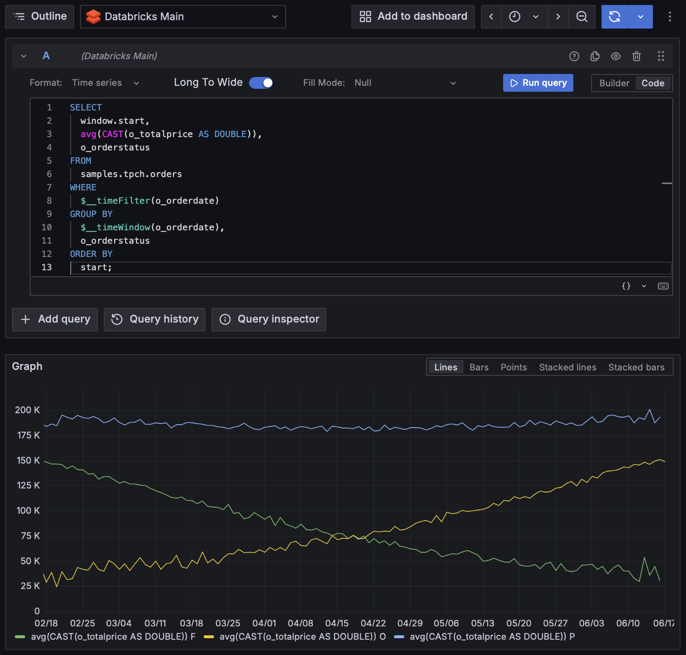

# Databricks - Grafana Data Source Backend Plugin


Grafana Databricks integration allowing direct connection to Databricks to query and visualize Databricks data in Grafana.



## Get started with the plugin

### Set up the Databricks Data Source
#### Install the Data Source

1. Install the plugin into the grafana plugin folder:
```shell
grafana-cli --pluginUrl https://github.com/mullerpeter/databricks-grafana/releases/latest/download/mullerpeter-databricks-datasource.zip plugins install mullerpeter-databricks-datasource
```
or
```shell
cd /var/lib/grafana/plugins/
wget https://github.com/mullerpeter/databricks-grafana/releases/latest/download/mullerpeter-databricks-datasource.zip
unzip mullerpeter-databricks-datasource.zip
```

2. Edit the grafana configuration file to allow unsigned plugins:
* Linux：/etc/grafana/grafana.ini
* macOS：/usr/local/etc/grafana/grafana.ini
```shell
[plugins]
allow_loading_unsigned_plugins = mullerpeter-databricks-datasource
```
Or with docker
```shell
docker run -d \
-p 3000:3000 \
-v "$(pwd)"/grafana-plugins:/var/lib/grafana/plugins \
--name=grafana \
-e "GF_PLUGINS_ALLOW_LOADING_UNSIGNED_PLUGINS=mullerpeter-databricks-datasource" \
grafana/grafana
```

3. Restart grafana

#### Configure the Datasource

* Open the side menu by clicking the Grafana icon in the top header.
* In the side menu under the Configuration icon you should find a link named Data Sources.
* Click the `+ Add data source` button in the top header.
* Select Databricks.

To configure the plugin use the values provided under JDBC/ODBC in the advanced options of the Databricks Cluster (or SQL Warehouse) and create a personal access token for Databricks.


Available configuration fields are as follows:

| Name            | Description                                                                             |
|-----------------|-----------------------------------------------------------------------------------------|
| Server Hostname | Databricks Server Hostname (without http). i.e. `XXX.cloud.databricks.com`              |
 | HTTP Path       | HTTP Path value for the existing cluster or SQL warehouse. i.e. `sql/1.0/endpoints/XXX` |
 | Access Token    | Personal Access Token for Databricks.                                                   |

### Supported Macros

All variables used in the SQL query get replaced by their respective values. See Grafana documentation for [Global Variables](https://grafana.com/docs/grafana/v9.3/dashboards/variables/add-template-variables/#global-variables).

Additionally the following Macros can be used within a query to simplify syntax and allow for dynamic parts.

| Macro example                | Description                                                                                                                                       |
|------------------------------|---------------------------------------------------------------------------------------------------------------------------------------------------|
| `$__timeFilter(time_column)` | Will be replaced by an expression to filter on the selected timerange. i.e. `time_column BETWEEN '2021-12-31 23:00:00' AND '2022-01-01 22:59:59'` |
| `$__timeWindow(time_column)` | Will be replaced by an expression to group by the selected interval. i.e. `window(time_column, '2 HOURS')`                                        |
 | `$__timeFrom`                | Will be replaced by the start of the selected timerange. i.e. `'2021-12-31 23:00:00'`                                                             |
 | `$__timeTo`                  | Will be replaced by the end of the selected timerange. i.e. `'2022-01-01 22:59:59'`                                                               |

## Write a query

Use the query editor to write a query, you can use sparksql syntax according to the [Databricks SQL Reference](https://docs.databricks.com/sql/language-manual/index.html).

#### Long to Wide Transformation

By default, the plugin will return the results in wide format. This behavior can be changed in the advanced options of the query editor.


### Examples
#### Single Value Time Series

```sparksql
SELECT $__time(time_column), avg(value_column)
FROM catalog.default.table_name 
WHERE $__timeFilter(time_column) 
GROUP BY $__timeWindow(time_column);
```
#### Multiple Values Time Series

```sparksql
SELECT window.start, avg(o_totalprice), o_orderstatus
FROM samples.tpch.orders
WHERE $__timeFilter(o_orderdate)
GROUP BY $__timeWindow(o_orderdate), o_orderstatus
ORDER BY start ASC;
```

# Development


## What is Grafana Data Source Backend Plugin?

Grafana supports a wide range of data sources, including Prometheus, MySQL, and even Datadog. There’s a good chance you can already visualize metrics from the systems you have set up. In some cases, though, you already have an in-house metrics solution that you’d like to add to your Grafana dashboards. Grafana Data Source Plugins enables integrating such solutions with Grafana.

For more information about backend plugins, refer to the documentation on [Backend plugins](https://grafana.com/docs/grafana/latest/developers/plugins/backend/).


## Getting started

A data source backend plugin consists of both frontend and backend components.

### Frontend

1. Install dependencies

   ```bash
   yarn install
   ```

2. Build plugin in development mode or run in watch mode

   ```bash
   yarn dev
   ```

   or

   ```bash
   yarn watch
   ```

3. Build plugin in production mode

   ```bash
   yarn build
   ```

### Backend

1. Update [Grafana plugin SDK for Go](https://grafana.com/docs/grafana/latest/developers/plugins/backend/grafana-plugin-sdk-for-go/) dependency to the latest minor version:

   ```bash
   go get -u github.com/grafana/grafana-plugin-sdk-go
   go mod tidy
   ```

2. Build backend plugin binaries for Linux, Windows and Darwin:

   ```bash
   mage -v
   ```

3. List all available Mage targets for additional commands:

   ```bash
   mage -l
   ```

## Learn more

- [Build a data source backend plugin tutorial](https://grafana.com/tutorials/build-a-data-source-backend-plugin)
- [Grafana documentation](https://grafana.com/docs/)
- [Grafana Tutorials](https://grafana.com/tutorials/) - Grafana Tutorials are step-by-step guides that help you make the most of Grafana
- [Grafana UI Library](https://developers.grafana.com/ui) - UI components to help you build interfaces using Grafana Design System
- [Grafana plugin SDK for Go](https://grafana.com/docs/grafana/latest/developers/plugins/backend/grafana-plugin-sdk-for-go/)
