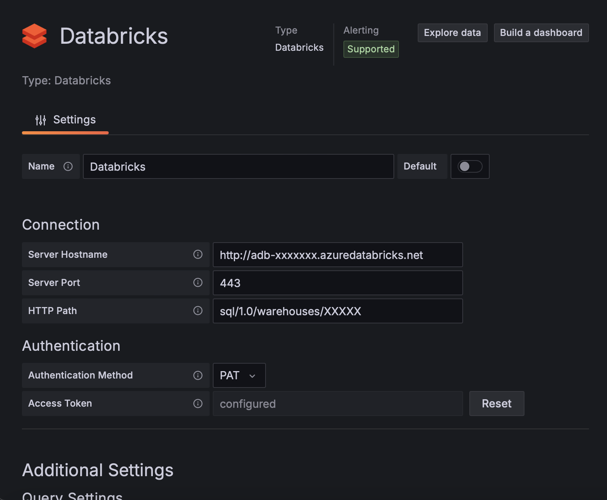

# Databricks - Grafana Data Source Backend Plugin


Grafana Databricks integration allowing direct connection to Databricks to query and visualize Databricks data in Grafana.


### Signing

The build plugin in the release section of this repo is signed for `localhost:3000`. If you want to use it on another domain, you either have build it without signing (or simply delete the `MANIFEST.txt`) and add the plugin ID to the `allow_loading_unsigned_plugins` in the grafana config or sign it yourself according to the [Grafana Documentation](https://grafana.com/docs/grafana/latest/developers/plugins/sign-a-plugin/).

defaults.ini
```
[plugins]
# Enter a comma-separated list of plugin identifiers to identify plugins to load even if they are unsigned. Plugins with modified signatures are never loaded.
allow_loading_unsigned_plugins = mullerpeter-databricks-datasource
```

## Plugin Configuration



To configure the plugin use the values provided under JDBC/ODBC in the advanced options of the Databricks Cluster and create a personal access token for Databricks.

# Development


## What is Grafana Data Source Backend Plugin?

Grafana supports a wide range of data sources, including Prometheus, MySQL, and even Datadog. There’s a good chance you can already visualize metrics from the systems you have set up. In some cases, though, you already have an in-house metrics solution that you’d like to add to your Grafana dashboards. Grafana Data Source Plugins enables integrating such solutions with Grafana.

For more information about backend plugins, refer to the documentation on [Backend plugins](https://grafana.com/docs/grafana/latest/developers/plugins/backend/).


## Getting started

A data source backend plugin consists of both frontend and backend components.

### Frontend

1. Install dependencies

   ```bash
   yarn install
   ```

2. Build plugin in development mode or run in watch mode

   ```bash
   yarn dev
   ```

   or

   ```bash
   yarn watch
   ```

3. Build plugin in production mode

   ```bash
   yarn build
   ```

### Backend

1. Update [Grafana plugin SDK for Go](https://grafana.com/docs/grafana/latest/developers/plugins/backend/grafana-plugin-sdk-for-go/) dependency to the latest minor version:

   ```bash
   go get -u github.com/grafana/grafana-plugin-sdk-go
   go mod tidy
   ```

2. Build backend plugin binaries for Linux, Windows and Darwin:

   ```bash
   mage -v
   ```

3. List all available Mage targets for additional commands:

   ```bash
   mage -l
   ```

## Learn more

- [Build a data source backend plugin tutorial](https://grafana.com/tutorials/build-a-data-source-backend-plugin)
- [Grafana documentation](https://grafana.com/docs/)
- [Grafana Tutorials](https://grafana.com/tutorials/) - Grafana Tutorials are step-by-step guides that help you make the most of Grafana
- [Grafana UI Library](https://developers.grafana.com/ui) - UI components to help you build interfaces using Grafana Design System
- [Grafana plugin SDK for Go](https://grafana.com/docs/grafana/latest/developers/plugins/backend/grafana-plugin-sdk-for-go/)
