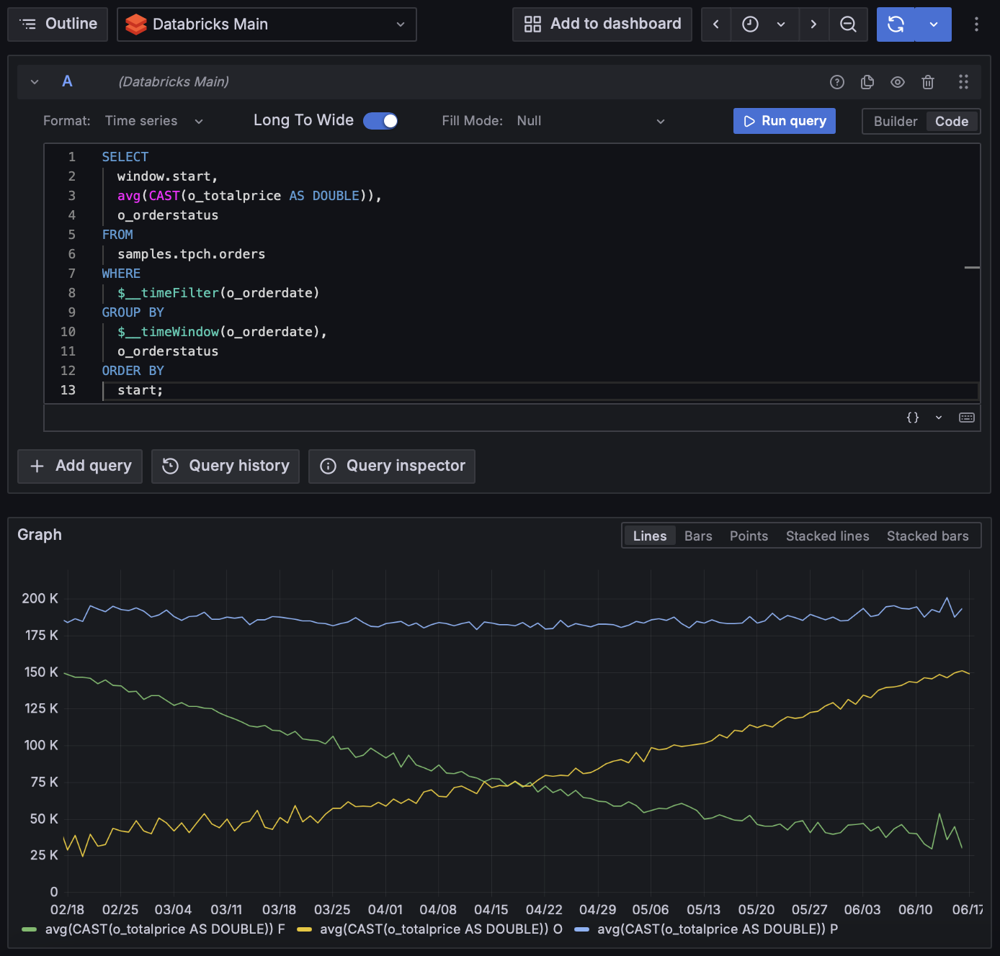
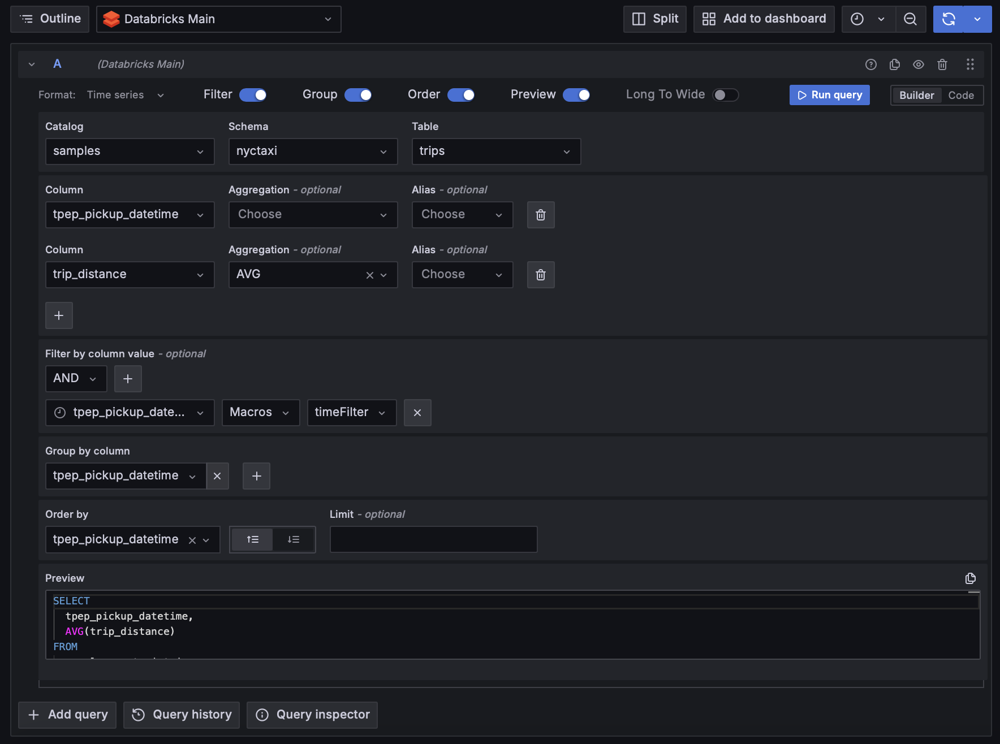
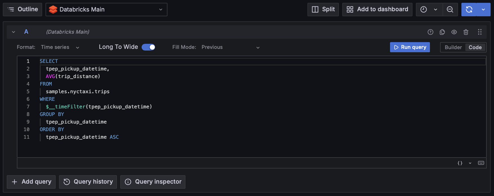

# Databricks - Grafana Data Source Backend Plugin


[]()


Grafana Databricks integration allowing direct connection to Databricks to query and visualize Databricks data in Grafana.



## Get started with the plugin

### Set up the Databricks Data Source
#### Requirements

For the latest version of the plugin the following requirements need to be met:
- Grafana Version >= 10.4.1

If you are using an earlier Grafana version try one of the following Plugin Versions:
- [v1.1.7](https://github.com/mullerpeter/databricks-grafana/releases/tag/v1.1.7) (Supports Grafana Version >= 7.4.0)
- [v1.2.9](https://github.com/mullerpeter/databricks-grafana/releases/tag/v1.2.9) (Supports Grafana Version >= 9.1.0)

#### Install the Data Source

1. Install the plugin into the grafana plugin folder:
```bash
grafana-cli --pluginUrl https://github.com/mullerpeter/databricks-grafana/releases/latest/download/mullerpeter-databricks-datasource.zip plugins install mullerpeter-databricks-datasource
```
or
```bash
cd /var/lib/grafana/plugins/
wget https://github.com/mullerpeter/databricks-grafana/releases/latest/download/mullerpeter-databricks-datasource.zip
unzip mullerpeter-databricks-datasource.zip
```

2. Edit the grafana configuration file to allow unsigned plugins:
* Linux：/etc/grafana/grafana.ini
* macOS：/usr/local/etc/grafana/grafana.ini

```ini
[plugins]
allow_loading_unsigned_plugins = mullerpeter-databricks-datasource
```

Or with docker

```bash
docker run -d \
-p 3000:3000 \
-v "$(pwd)"/grafana-plugins:/var/lib/grafana/plugins \
--name=grafana \
-e "GF_PLUGINS_ALLOW_LOADING_UNSIGNED_PLUGINS=mullerpeter-databricks-datasource" \
grafana/grafana
```

3. Restart grafana

#### Configure the Datasource

* Open the side menu by clicking the Grafana icon in the top header.
* In the side menu under the Configuration icon you should find a link named Data Sources.
* Click the `+ Add data source` button in the top header.
* Select Databricks.

To configure the plugin use the values provided under JDBC/ODBC in the advanced options of the Databricks Cluster (or SQL Warehouse) and the the Credentials according to the chosen Authentication Method.

##### Authentication Methods
- [Personal Access Token (PAT)](https://docs.databricks.com/en/dev-tools/auth/pat.html)
- [Databricks M2M OAuth](https://docs.databricks.com/en/dev-tools/auth/oauth-m2m.html) using a Service Principal Client ID and Client Secret
- External OAuth Client Credential Endpoint which returns a Databricks token (the OAuth endpoint should implement the default [OAuth Client Credential Grant](https://datatracker.ietf.org/doc/html/rfc6749#section-4.4)) i.e. Azure Entra (OAuth2 Endpoint `https://login.microsoftonline.com/{tenant-id}/oauth2/v2.0/token` & Scope `2ff814a6-3304-4ab8-85cb-cd0e6f879c1d/.default`)
- Azure Entra Pass Thru, which uses the Entra Auth token from the signed in user (IMPORTANT: `2ff814a6-3304-4ab8-85cb-cd0e6f879c1d/.default` has to be added to the scopes of the Entra Auth configuration in Grafana!). Additionally the plugin won't work with this option selected if the user is not signed in via Azure Entra SSO and for backend Grafana Tasks (e.g.Alerting).


Available configuration fields are as follows:

| Name                   | Description                                                                                                                                                                  |
|------------------------|------------------------------------------------------------------------------------------------------------------------------------------------------------------------------|
| Server Hostname        | Databricks Server Hostname (without http). i.e. `XXX.cloud.databricks.com`                                                                                                   |
| Server Port            | Databricks Server Port (default `443`)                                                                                                                                       |
| HTTP Path              | HTTP Path value for the existing cluster or SQL warehouse. i.e. `sql/1.0/endpoints/XXX`                                                                                      |
| Authentication Method  | PAT (Personal Access Token), M2M (Machine to Machine) OAuth, OAuth2 Client Credentials Authentication or Azure Entra Pass Thru                                               |
| Client ID              | Databricks Service Principal Client ID. (only if OAuth / OAuth2 is chosen as Auth Method)                                                                                    |
| Client Secret          | Databricks Service Principal Client Secret. (only if OAuth / OAuth2 is chosen as Auth Method)                                                                                |
| Access Token           | Personal Access Token for Databricks. (only if PAT is chosen as Auth Method)                                                                                                 |
| OAuth2 Token Endpoint  | URL of OAuth2 endpoint (only if OAuth2 Client Credentials Authentication is chosen as Auth Method)                                                                           |
| OAuth2 Scopes          | Comma separated list of OAuth2 scopes. (only if OAuth2 Client Credentials Authentication is chosen as Auth Method)                                                           |
| Min Interval (Default) | Min Interval default value for all queries. A lower limit for the interval. Recommended to be set to write frequency, for example `1m` if your data is written every minute. |
| Max Open               | The maximum number of open connections to the database. (0 = unlimited)                                                                                                      |
| Max Idle               | The maximum number of idle connections to the database. (0 = no idle connections are retained)                                                                               |
| Max Idle Time          | The maximum amount of time in seconds a connection may be idle before being closed. If set to 0, connections can be idle forever.                                            |
| Max Lifetime           | The maximum amount of time in seconds a connection may be reused. If set to 0, connections are reused forever.                                                               |
| Retries                | The number of retries to perform. (Default 4)                                                                                                                                |
| Retry Backoff          | The time in seconds to wait between retries. (Default 1)                                                                                                                     |
| Max Retry Duration     | The maximum time in seconds to retry a query. (Default 30)                                                                                                                   |
| Timeout                | Adds timeout for the server query execution. Default is no timeout (0).                                                                                                      |
| Max Rows               | The maximum number of rows to return in a query. (Default 10'000)                                                                                                            |
| Default Query Format   | The default format for new queries. (Table or Timer series)                                                                                                                  |
| Default Editor Mode    | The default editor mode for new queries. (Code or Builder)                                                                                                                   |


##### Configuration via YAML

The Datasource configuration can also be done via a YAML file as described [here](https://grafana.com/docs/grafana/latest/administration/provisioning/). The configuration parameters are the same as described above and named as follows:

```yaml
datasources:
   - name: Databricks
     type: mullerpeter-databricks-datasource
     isDefault: true
     jsonData:
        hostname: XXX.cloud.databricks.com
        httpPath: sql/1.0/endpoints/XXX
        port: 443
        authenticationMethod: dsn (=PAT) | m2m | oauth2_client_credentials | azure_entra_pass_thru
        clientId: ...
        externalCredentialsUrl: ...
        oauthScopes: api,read
        timeInterval: 1m
        maxOpenConns: 0
        maxIdleConns: 0
        connMaxLifetime: 3600
        connMaxIdleTime: 3600
        retries: 3
        retryBackoff: 1
        maxRetryDuration: 60
        timeout: 60
        maxRows: 10000
        defaultQueryFormat: table | time_series
        defaultEditorMode: builder | code
     secureJsonData:
        clientSecret: ...
        token: ...
```
### Supported Macros

All variables used in the SQL query get replaced by their respective values. See Grafana documentation for [Global Variables](https://grafana.com/docs/grafana/v9.3/dashboards/variables/add-template-variables/#global-variables).

Additionally the following Macros can be used within a query to simplify syntax and allow for dynamic parts.

| Macro example                          | Description                                                                                                                                                                  |
|----------------------------------------|------------------------------------------------------------------------------------------------------------------------------------------------------------------------------|
| `$__timeFilter(time_column)`           | Will be replaced by an expression to filter on the selected timerange. i.e. `time_column BETWEEN '2021-12-31 23:00:00' AND '2022-01-01 22:59:59'`                            |
| `$__timeWindow(time_column)`           | Will be replaced by an expression to group by the selected interval. i.e. `window(time_column, '2 HOURS')`                                                                   |
| `$__unixEpochFilter(time_column)`      | Will be replaced by an expression to filter on the selected timerange based on Unix Timestamps. i.e. `time_column BETWEEN 1640988000 AND 1641074399`                         |
| `$__unixEpochNanoFilter(time_column)`  | Will be replaced by an expression to filter on the selected timerange based on nanosecond Timestamps. i.e. `time_column BETWEEN 1640988000506935834 AND 1641074399589026839` |
| `$__timeGroup(time_column,'interval')` | Will be replaced by a window expression i.e. `window(time_column, 'interval')`                                                                                               |
| `$__timeFrom`                          | Will be replaced by the start of the selected timerange. i.e. `'2021-12-31 23:00:00'`                                                                                        |
| `$__timeTo`                            | Will be replaced by the end of the selected timerange. i.e. `'2022-01-01 22:59:59'`                                                                                          |
| `$__timeFrom()`                        | Will be replaced by the start of the selected timerange. i.e. `'2021-12-31 23:00:00'` (via `FROM_UNIXTIME(..)`)                                                              |
| `$__timeTo()`                          | Will be replaced by the end of the selected timerange. i.e. `'2022-01-01 22:59:59'` (via `FROM_UNIXTIME(..)`)                                                                |
| `$____interval_long`                   | Converts Grafana’s interval to INTERVAL DAY TO SECOND literal. i.e. `1 HOUR 20 MINUTES` This is applicable to Spark SQL window grouping expression.                          |
| `$__unixEpochFrom()`                   | Will be replaced by the start of the selected timerange as a Unix Timestamp. i.e. `1640988000`                                                                               |
| `$__unixEpochTo()`                     | Will be replaced by the end of the selected timerange as a Unix Timestamp. i.e. `1641074399`                                                                                 |
| `$__unixEpochNanoFrom()`               | Will be replaced by the start of the selected timerange as a nanosecond Timestamp. i.e. `1640988000506935834`                                                                |
| `$__unixEpochNanoTo()`                 | Will be replaced by the end of the selected timerange as a nanosecond Timestamp. i.e. `1641074399589026839`                                                                  |    


## Write a query

You can write a query in two ways: using the visual query builder or the code editor.

### Visual Query Builder

Simple queries can be created using the visual query builder. The visual query builder will automatically fetch the avaible catalogs, schemas, tables & columns from the Databricks Instance. The build query will be displayed in the preview window.

Support for complex queries is limited, for more complex queries use the code editor, which also supports all available macros.



### Code Editor

Use the code editor to write a query, you can use sparksql syntax according to the [Databricks SQL Reference](https://docs.databricks.com/sql/language-manual/index.html). The code editor supports all available macros and code autocompletion.



#### Long to Wide Transformation

Both the Visual Query Builder and the Code Editor support the transformation of long to wide tables. If enabled this transformation will be executed on the Grafana backend before the data is returned to the frontend. This functionality is useful incase you want the query to return multiple time series, as not all Grafana visualizations support long format tables for multiple metrics.


### Examples
#### Single Value Time Series

```sql
SELECT
   window.start,
   avg(value_column)
FROM
   catalog.default.table_name
WHERE
   $__timeFilter(time_column)
GROUP BY
   $__timeWindow(time_column);
```
#### Multiple Values Time Series

```sql
SELECT
   window.start,
   avg(CAST(o_totalprice AS DOUBLE)),
   o_orderstatus
FROM
   samples.tpch.orders
WHERE
   $__timeFilter(o_orderdate)
GROUP BY
   $__timeWindow(o_orderdate),
   o_orderstatus
ORDER BY
start;
```

# Development


## What is Grafana Data Source Backend Plugin?

Grafana supports a wide range of data sources, including Prometheus, MySQL, and even Datadog. There’s a good chance you can already visualize metrics from the systems you have set up. In some cases, though, you already have an in-house metrics solution that you’d like to add to your Grafana dashboards. Grafana Data Source Plugins enables integrating such solutions with Grafana.

For more information about backend plugins, refer to the documentation on [Backend plugins](https://grafana.com/docs/grafana/latest/developers/plugins/backend/).


## Getting started

A data source backend plugin consists of both frontend and backend components.

### Frontend

1. Install dependencies

   ```bash
   yarn install
   ```

2. Build plugin in development mode or run in watch mode

   ```bash
   yarn dev
   ```

   or

   ```bash
   yarn watch
   ```

3. Build plugin in production mode

   ```bash
   yarn build
   ```

### Backend

1. Update [Grafana plugin SDK for Go](https://grafana.com/docs/grafana/latest/developers/plugins/backend/grafana-plugin-sdk-for-go/) dependency to the latest minor version:

   ```bash
   go get -u github.com/grafana/grafana-plugin-sdk-go
   go mod tidy
   ```

2. Build backend plugin binaries for Linux, Windows and Darwin:

   ```bash
   mage -v
   ```

3. List all available Mage targets for additional commands:

   ```bash
   mage -l
   ```

## Learn more

- [Build a data source backend plugin tutorial](https://grafana.com/tutorials/build-a-data-source-backend-plugin)
- [Grafana documentation](https://grafana.com/docs/)
- [Grafana Tutorials](https://grafana.com/tutorials/) - Grafana Tutorials are step-by-step guides that help you make the most of Grafana
- [Grafana UI Library](https://developers.grafana.com/ui) - UI components to help you build interfaces using Grafana Design System
- [Grafana plugin SDK for Go](https://grafana.com/docs/grafana/latest/developers/plugins/backend/grafana-plugin-sdk-for-go/)
